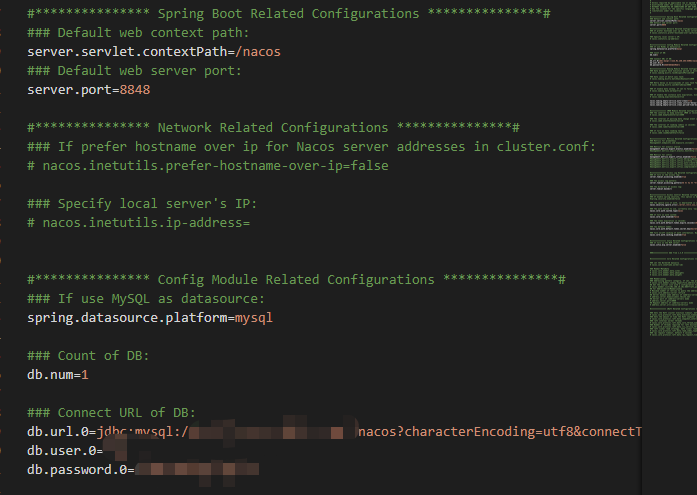

## window安装Nacos

### 去Nacos官网下载本地应用

[*.zip下载链接](https://github.com/alibaba/nacos/releases/download/2.2.0.1/nacos-server-2.2.0.1.zip)
[*.tar.gz下载链接](https://github.com/alibaba/nacos/releases/download/2.2.0.1/nacos-server-2.2.0.1.tar.gz)

### 配置nacos配置文件

安装完成后,在`nacos/conf/`目录下编辑`application.properties`文件
配置连接数据库的文件

```bash
db.url.0=jdbc:mysql://***.***.**.*:3306/nacos?characterEncoding=utf8&connectTimeout=1000&socketTimeout=3000&autoReconnect=true&useUnicode=true&useSSL=false&serverTimezone=UTC
db.user.0=***
db.password.0=******
```



### 连接数据库

下载`mysql`,不在此赘述[^mysql安装]

<u>在`nacos\conf`目录下找到`nacos-mysql.sql`文件,复制sql去第二步配置的数据库中执行sql文件</u>

### 启动nacos

在`nacos/bin/`目录下找到`startup.cmd`双击执行程序
- - -
本地调试情况下，需要右键编辑`startup.cmd`修改文件

```bash
set MODE="cluster"
# 修改为
set MODE="standalone"
# 所以在走下面的逻辑时会走集群模式的逻辑

if %MODE% == "standalone" (
    echo "nacos is starting with standalone"
   set"NACOS_OPTS=-Dnacos.standalone=true"
    set "NACOS_JVM_OPTS=-Xms512m -Xmx512m -Xmn256m"
)
 
rem if nacos startup mode is cluster
if %MODE% == "cluster" (
    echo "nacos is starting with cluster"
   if %EMBEDDED_STORAGE% == "embedded" (
       set"NACOS_OPTS=-DembeddedStorage=true"
   )
 
    set "NACOS_JVM_OPTS=-server -Xms2g -Xmx2g -Xmn1g -XX:MetaspaceSize=128m -XX:MaxMetaspaceSize=320m -XX:-OmitStackTraceInFastThrow -XX:+HeapDumpOnOutOfMemoryError -XX:HeapDumpPath=%BASE_DIR%\logs\java_heapdump.hprof -XX:-UseLargePages"
)

```

[^mysql安装]: __去其他博客内文章搜索__(centos安装mysql)
